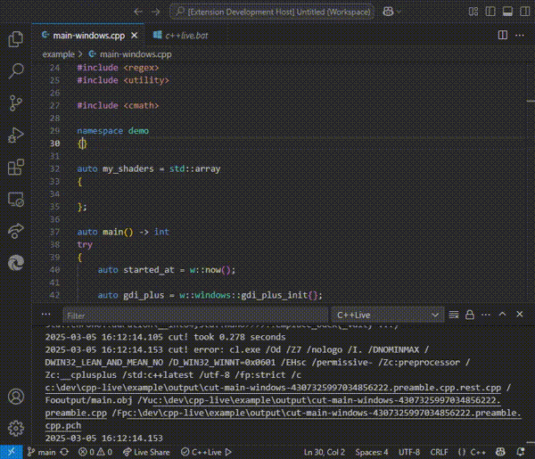

# C++Live extension for Visual Studio Code

This builds your C++ in real time as you type by running `c++live.bat` (or `c++live.sh`) in any parent directory of the C++ source file you are editing. No longer need to press `Ctrl-S` or `Ctrl-Shift-B` when editing C++ files.



## Example

There is an example you can play with. When C++Live extension is installed, activate **Help** -> **Welcome** in the main menu, click **More...**, then click **Get Started With C++Live**. Make sure all prerequisites are met, then click **Open example**. This will download and build [Cut!](https://github.com/segfault-survivor/cut) and pre-compile the example. When everything is ready, start editing the `main-windows.cpp` (or `main-linux.cpp`) source file.

### Prerequisites

In Windows, you can install everything from the command line:

```
winget install Git.Git
```
<!--- or Microsoft.Git --->
```
winget install LLVM.LLVM
```
```
winget install Microsoft.VisualStudio.2022.Community.Preview --silent --override "--wait --quiet --add Microsoft.VisualStudio.Workload.NativeDesktop --includeRecommended"
```
<!--- or
Microsoft.VisualStudio.2022.Community
Microsoft.VisualStudio.2022.Enterprise
Microsoft.VisualStudio.2022.Enterprise.Preview
Microsoft.VisualStudio.2022.Professional
Microsoft.VisualStudio.2022.Professional.Preview
--->

## Known issues

* [Clear output doesn't clear output buffer](https://github.com/microsoft/vscode/issues/82750) is marked as Closed, but in fact the bug is still here. There is `cpp-live.maxLines` setting to make this bug less likely.

* Due to the data race in [tree-kill](https://www.npmjs.com/package/tree-kill) in Linux, it sometimes leaves child processes running.

* Sometimes compiles old version.

* Sometimes it cannot save the source file in Windows because taskkill.exe is failing (less likely with "cpp-live.jobify" set to true). VSCode shows a notification in the bottom right corner:
    ```
    Failed to save 'your-file.cpp': Unable to write file 'c:\<path>\your-file.cpp' (Unknown (FileSystemError): Error: EBUSY: resource busy or locked, open 'c:\<path>\your-file.cpp').
    ```
    Please don't worry and keep editing.

* The example may run slow due to the use of a single CPU core when running libstdc++ from gcc-14. You might need to apply the [patch](https://gcc.gnu.org/git/gitweb.cgi?p=gcc.git;h=c5fd1a483858c0e85b40149aef88be00f94980a7).

* The VSCode clangd extension can add `#include` directives automatically, which causes PCH to be recompiled.

*  tracker.exe not found - happens after Visual Studio update. Please delete `output/env` file or nuke the whole `output` directory.
